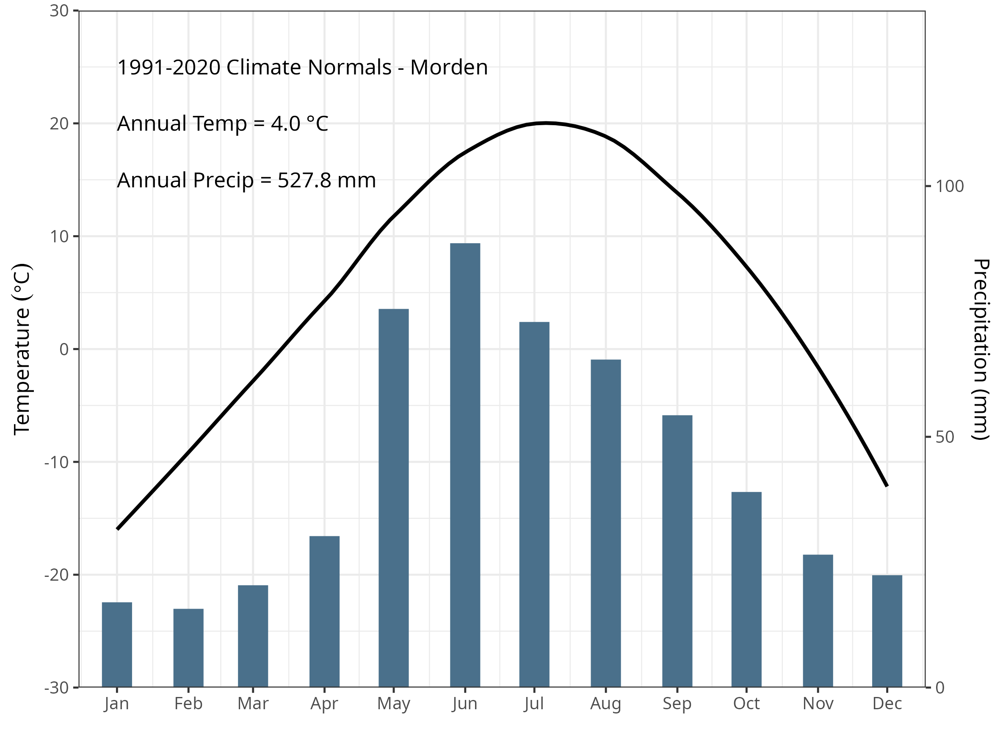

<!-- ## Potential journals {.unnumbered} -->

<!-- - Soil and Tillage Research -->

<!--   - A Short Communication is a concise but complete description of a limited investigation, which will not be included in a later paper. Short Communications should be as completely documented, both by reference to the literature and description of the experimental procedures employed, as a regular paper. They should not occupy more than 6 printed pages (about 12 manuscript pages, including figures, tables and references). -->

<!--   - Pretty sure BU has a publishing agreement so it should be free to publish -->

## Introduction

Plastics are extensively used in all aspects of life, including residential, commercial, industrial, agricultural and institutional sectors. Through improper disposal, accidental and incidental releases, and intentional placement, plastics have become a widespread pollutant found in every ecosystem. This has resulted in global concern surrounding the effects of plastic pollution on ecosystem and human health [@zhang2022]. Of particular concern, are micro-plastics (MPs) (\<5mm) due to their movement and health impacts within the food chain and their rapid dispersion beyond their initial point of release. Despite the ubiquitous distribution of MP pollution across all ecosystem types, the focus has primarily been on marine and freshwater ecosystems [@anderson2017; @lenaker2021] and with an emphasis on urban and industrial sources. A 2021 survey of the plastic pollution literature found that only 4% of publications specifically investigated MPs in soils [@weber2021]. Agriculture and soil have received relatively less attention despite the prevalent use of plastics, including horticultural mulch, twine, bale wrap, product bags and containers, and polymer-coated slow-release fertilizers [@rillig2017].

There is currently little information on the concentration, distribution, or types of plastic in agricultural soil, the effect they have on soil and plant health and the extent as to which agro-ecosystems are a net source of MPs to downstream ecosystems [@chinyo2026]. Even within agriculture and soil science disciplines, the focus has largely been on assessing the risks associated with applying municipal biosolids as a soil amendment which have been shown to have higher concentrations of MPs [@crossman2020]. In terms of deliberate applications to agricultural soil, polymer-coated slow-release fertilizers represent a large input of MPs. While these slow-release fertilizers improve nitrogen-use efficiency, the low rates of degradation coupled with repeated applications lead to accumulation within the soil [@isakov2025]. There is a considerable gap in our understanding of the nature of MPs in soils both in terms of the direct impact on the agro-ecosystem health and as a source of MPs to downstream ecosystems.

Soil erosion, including tillage and surface water runoff actively redistribute MPs across agricultural landscapes [@rehm2024; @wang2024]. Due to their low density, these buoyant particles are easily transported beyond field boundaries into adjacent environments making agricultural soils a likely source of MPs [@leonard2024]. Given the lack of basic research on agricultural soil MPs, specifically in cold snowmelt dominated agricultural systems, this is a high-priority research area [@environmentandclimatechangecanada2020]. The primary purpose of this pilot project was to investigate the fate of polymer coatings from slow-release fertilizers applied to agro-ecosystems in Manitoba, Canada. Because these coatings are applied in known quantities, locations, and timings, they are an ideal model plastic input for investigating the fate of agricultural MPs. The objectives of this project were to: 1) characterize the lateral and vertical movement of polymer coatings within surface soils; and 2) estimate the export of polymer coatings from cropland in surface runoff during spring snowmelt.

## Methods

### Site description

The study site is located near the edge of the Manitoba Escarpment in the South Tobacco Creek Watershed (STCW), near the town of Miami, Manitoba, Canada (49.3711°N, 98.2439°W; 445 masl) (@fig-mapr). The mean annual temperature is \~4 °C, and the mean annual precipitation is 527 mm, of which approximately 15% occurs as snow (@environmentandclimatechangecanada2026; Morden MB, climate ID 5021849, 1991–2020 normals; @suppfig-climate-normals). The topography is hummocky to undulating, with slope gradients of approximately 5%. Soils are classified as Orthic Dark Grey Chernozems, predominantly of the Dezwood Series. The Dezwood Series developed on moderately to strongly calcareous, deep, uniform, loamy mixed shale, limestone, and granite till deposits. These soils are often slightly eroded and slightly stony, with medium available water-holding capacity, medium organic matter content, and medium to high natural fertility [@michalyna1988].



The STCW has a long history of being part of a national program aimed at assessing the economic and water quality impacts of different agricultural practices across Canada [@agricultureandagri-foodcanada2011]. Within the STCW the research site comprises two small paired watersheds that drain to edge-of-field weirs: the west watershed (5.15 ha) and the east watershed (4.16 ha). Historically, these watersheds were used to compare runoff and nutrient loading from zero-tillage and conventionally tilled fields [@tiessen2010]. Both watersheds are now managed under the same practices. Polymer-coated urea (Environmental Smart Nitrogen (ESN); @nutrien_esn_datasheet_2022) was broadcast applied at a rate of 110 kg ha^-1^ on 2022-05-24 using a spin spreader and incorporated into the surface soil with the seeding of canola on 2022-05-25 using an air hoe drill. Following canola harvest, the field was tilled to a depth of 10 to 15 cm using a field cultivator on 2022-10-29. A conventional fertilizer blend (not polymer coated) was applied in the spring of 2023 and incorporated into the soil with a single pass of the field cultivator prior to the seeding of spring wheat using the air hoe drill on 2023-05-11 (@fig-weather-climate). ESN’s polymer coating is primarily composed of castor oil and polymethylene polyphenylene isocyanate [@nutrien_esn_2026]. This polymer coating is designed to release nitrogen in response to soil temperatures to more closely match the demand of the crop reducing the potential losses through denitrification, volatilization, and leaching.



### Soil sampling and analysis

Soil sampling was conducted at locations established in previous research [@tiessen2010] along four transects in each of the watersheds, with each transect spanning three hillslope positions: upper, mid, and lower slope (@fig-mapr), giving 24 sampling locations in total. Samples were collected on three dates: 21 October 2022, 11 May 2023, and 19 September 2023 (@fig-weather-climate). Surface soil samples were excavated with a spade from a 25 cm × 25 cm square to a depth of 5 cm, yielding a sample volume of 3125 cm³. On 19 September 2023, an additional sample was collected at each location from the 5–10 cm depth interval. Two additional surface riparian samples were also collected from each watershed on this date.

Soil samples were disaggregated by hand into smaller aggregates and air-dried. Each sample was further manually disaggregated and sieved sequentially through 2-mm and 1.18-mm meshes. Polymer coatings were retrieved from the sieves using tweezers. The extracted coatings were cleaned by magnetic stirring in distilled water for 10 minutes at 500 rpm, then filtered and dried at 30 °C. The cleaned and dried polymer coatings were counted and collectively weighed using a balance with 0.1 mg resolution.

### Runoff and water sampling

A v-notched weir was installed in the riparian area at the outflow of each watershed. The water depth at the weirs was recorded at 5-min intervals using a pressure transducer (Onset HOBO Water Level Data Logger). The water depth were then used to calculate flow, based on a standard v-notched weir flow equation [@astm_d5242_92]. Throughout the runoff event, staff gauges read manually and from time-lapse photography were used to verify the logger-collected water depth data. Measurement of polymer coatings exported by surface runoff occurred on 2023-04-13, and 2023-04-14. Polymer coatings were collected from the runoff using a simple filtration system consisting of 1-mm screening set across the upstream side of the v notch. These screens were deployed for a maximum duration of two hours and switched twice a day for a total of four measurement periods at each watershed weir over the spring runoff event. Polymers coatings were extracted from the screens using tweezers. The Polymers coatings were dried at 30° C, counted and weighed. An incremental volume of water was calculated based on the flow rate over a set interval time of 15 minutes. The total estimated number of polymer coatings was extrapolated from periodic measurements by multiplying the total accumulated volume of water by the volume-weighted mean concentration of polymer coatings. Polymer coating concentration was assumed to be independent of discharge.

$$PC = V \times \frac{\sum_{i=1}^{n} PC_i}{\sum_{i=1}^{n} V_i}$$ {#eq-poly}

where $PC$ is the total estimated number of polymer coatings over the monitoring period, $V$ is the total accumulated volume of water over the monitoring period (m^3^), $PC_i$ is the number of polymer coatings counted during measurement period $i$, $V_i$ is the volume of water that passed during measurement period $i$ (m^3^), and $n$ is the number of measurement periods.

### Statistical analysis

All statistical analysis, plotting, and mapping were undertaken using the R Statistical Software (v4.5.3); @rcoreteam2026), through the RStudio Integrated Development Environment (v2026.05.1; [@rstudio2026] ). All plots and maps were created using the R package `ggplot2` (v4.0.3; @wickham2016). Country and regional maps were created using data from the `rnaturalearth` package [@massicotte2023] and other maps using ESRI imagery and the `OpenStreetMap` package [@fellows2023]. Weather data and climate normal data was retrieved from Environment and Climate Change Canada [-@environmentandclimatechangecanada2026] using `weathercan` package (v1.0.0; @e.lazerte2018). Two Linear Mixed Models (R package `glmmTMB` v1.1.14; @brooks2017) were used to investigate the effect of hillslope position and sampling date (including interaction) on the abundance (number of coatings) and areal density (mass of polymer per unit area). Sample location was included as a random factor to control for the repeated measures over time. When a main effect was significant, post-hoc pairwise comparisons with a Benjamini-Hochberg p-value adjustment was used (`emmeans` v2.0.3; @lenth2024 ). Model assumptions were assessed using DHARMa residual plots (`DHARMa` v0.5.0; @hartig2022), main effects were tested for collinearity (`performance` v0.17.0; @ludecke2021), and results were presented as type III ANOVA (`car` v3.1.3; @fox2019).

## Results and Discussion

### In-field abundance and distribution

In the statistical model investigating polymer abundance, the estimated variance for the random factor of sampling location was effectively zero, and this factor was removed from the model. No significant interaction between sampling date and hillslope position was detected for the abundance or density of polymer coatings in the 0-5 cm layer and this term was removed from the model. Both slope position and sampling date had a significant effect (p \< 0.05) on the abundance and density of polymer coatings (@fig-poly-surface). Post-hoc pairwise comparisons showed that lower slope positions had significantly higher abundance, exceeding the upper positions by 112 coatings m⁻² and the mid positions by 94 coatings m⁻² (@fig-poly-surface and @tbl-abundance-posthoc). Density followed a similar pattern, with the lower slope exceeding the upper positions by 0.12 g m⁻² and the mid positions by 0.09 g m⁻² (@fig-poly-surface and @tbl-density-posthoc). There were some coatings observed in the riparian area surface soil, despite receiving no direct application (@fig-poly-surface).

The downslope increase in polymer quantities could relate to movement via overland flow, as the buoyant nature of the coatings makes them easy to transport [@severe2025; @rehm2021]. Similarly, tillage erosion may also move coatings downslope with the soil [@maqbool2024]. The overall reduction in polymer in surface soils over time may result from loss beyond the field boundary through overland flow. However, vertical movement below 5 cm likely accounts for much of this observed loss in surface MPs over time, as field operations including seeding and tillage mix the plow layer, resulting in downward movement despite surface application. No coatings were observed below 5 cm within the riparian area, supporting the conclusion that tillage is the primary driver of vertical coating distribution. This is supported by data showing similar polymer abundance and areal densities in both the 0-5 and 5-10 cm sampling depths (@fig-depth). Lastly, the reduction in polymer density may also be attributed to decomposition of the polymer over time. The relatively small loss is consistent with coating persistence in the soil environment and repeat applications of polymer coated fertilizers are likely to lead to accumulation of coatings.









The distribution of MPs in soil within agro-ecosystems is dynamic in both space and time, and continued research in this area must account for both dimensions when developing research ideas and sampling strategies. Currently, few guidelines or established sampling protocols are in place [@chia2024]. The results of this study suggest that a transect approach along the catena is likely to capture the topographically driven variability, providing detailed information with lower effort compared to a grid or random sampling approach. The results also demonstrate the importance of sampling depth. While the surface layer (0-5 cm) is important for investigating loss through surface processes, a complete inventory is needed for long-term studies. At a minimum, sampling should extend to the depth of the deepest tillage operation, but preferential flow paths and bioturbation may carry MPs deeper into the soil profile. Ideally incremental depth sampling is used to characterize the concentration of MPs with depth to provide a full inventory. In this study, the polymer coated fertilizer was broadcast applied, resulting in a relatively uniform horizontal distribution of MPs; however, where fertilizer is banded, sampling must span the full width of the bands to account for the concentrated horizontal distribution of polymer coatings.

Beyond sampling strategy, additional work is needed to examine temporal and spatial patterns of other types and sources of agricultural MPs. Much of the literature on microplastics has focused on soils receiving biosolids, which often contain substantial amounts of plastics. On many farms in Manitoba, biosolids are not used as a soil amendment; however, the sources of MPs are instead on-farm uses (e.g., bale wrap, twine, bags/containers) or external sources through atmospheric deposition or overland flooding [@chinyo2026]. In these cases, concentrations are likely to be very low, adding further challenges to quantifying and identifying MPs [@piehl2018]. Nonetheless, the dynamic nature observed with the polymer coatings in this study is likely transferable to a wide range of plastic types and sizes.

### Runoff and loss

The long-term normal annual precipitation is 527 mm. The year of application (2022) received near-normal precipitation, while the 2023 water year was notably drier, accumulating only 250 mm. In particular, late fall and winter precipitation (October 1 to March 31) was substantially below average, totaling 50 mm in 2023 (@fig-discharge) compared to the long-term average of 141 mm for this period. During the 2023 spring runoff period, the West watershed (5.15 ha) had a higher volume-weighted mean concentration of 0.071 coatings m⁻³, resulting in an estimated 171 total coatings exported despite a lower accumulated runoff volume of 2,424 m³ (@tbl-runoff). In contrast, the East watershed (4.16 ha) produced nearly twice the runoff (4,675 m³) but had a lower concentration of 0.027 coatings m⁻³, exporting an estimated 126 coatings (@tbl-runoff). Overall, concentration rather than runoff volume was the primary driver of total coatings export between the two watersheds. The manual measurements made as part of this study sampled only a small portion of the runoff event, missing the larger peaks in the hydrograph. By missing peak runoff, these measurements provided a limited overall characterization of both concentration and total coating loss. Additionally, the drier conditions in 2023 resulted in lower runoff volumes, potentially accounting for the small numbers of coatings observed. Future studies should sample across various parts of the hydrograph and across a range of spring snowmelt conditions, including wet and dry years, flashy and subdued hydrographs, and varying frequencies of freeze-thaw cycles. This broader approach would better capture the role of environmental conditions and runoff volumes on the transport and export of polymer coatings and other MPs.





Agricultural soils can serve as a long-term source of microplastics (MPs) to downstream ecosystems [@rehm2021]. Although concentrations in agricultural soil may be low, the extensive area of farmland means the total load can be considerable. In snowmelt-dominated regions like Manitoba, the snowmelt period is when the greatest losses are likely to occur; however, during this time, riparian areas have frozen soils and dormant vegetation, reducing their filtering capabilities and making riparian buffers less effective as a management practice for mitigating MP loss. Quantifying MPs in agricultural runoff presents methodological challenges: low concentrations necessitate filtering large volumes of runoff, and traditional automatic water samplers are likely insufficient for this purpose. While the simple screens used in this study allowed for large volumes of water to be filtered, this method has some limitations. Clogging with organic debris (e.g., crop residues) and sediment is an issue, and freezing of water on the screen during frequent freeze-thaw cycles similarly impedes flow. Further, the large mesh size used only captures larger MPs, and smaller MPs are not represented in this study. Better edge-of-field runoff sampling approaches are needed for these types of conditions to capture the full range of MP sizes. In particular, automated sampling systems are required to fully characterize all parts of the hydrograph, as manual grab sampling is unlikely to capture the rapidly changing flow conditions and associated MP concentrations throughout the runoff event. Lastly, this study did not investigate the role of shorter-duration, high-intensity rain events during the summer months as a potential pathway for MP export.

## Conclusions

Polymer coatings from slow-release fertilizers showed clear spatial and temporal dynamics, with evidence of downslope movement and export to downstream environments, demonstrating that agricultural soils can serve as a long-term source of MPs. Soil sampling and edge of field runoff designs and research questions must account for this spatial and temporal variability, and developing best practices for sampling MPs in agricultural settings should be a research priority. The findings of this study are likely applicable to other types of agricultural plastics, which may show similar transport dynamics. Edge-of-field sampling in cold climates presents particular challenges, as low concentrations require filtering large volumes of runoff and freeze-thaw conditions and debris impede water flow through sampling equipment, highlighting the need for improved sampling approaches that can reliably quantify MP export under these conditions. As plastic inputs to agricultural landscapes continue to grow, whether from on-farm use or external sources, characterizing and managing MP movement through the landscape will be essential to effectively quantify and mitigate their broader environmental impact.

## Acknowledgments {.unnumbered}

Special thanks and recognition for the field and technical support from C Jackson and J Griffith. Also

## Statements and declarations {.unnumbered}

### Funding {.unnumbered}

This research was supported by ...

### Competing interests {.unnumbered}

The authors have no competing interests to declare that are relevant to the content of this article.

### Data and code availability {.unnumbered}

Data and source code for analysis and manuscript available on GitHub: <https://github.com/alex-koiter/soil-plastics>

Additional information, including analytical notebooks with details of the analysis and intermediate steps, is available online: <https://alexkoiter.ca/soil-plastics/>

### Author contributions {.unnumbered}

**C Beaupre** Methodology; Investigation; Data curation; Formal analysis; Writing - Original Draft; Writing - Review & Editing

**A Glenn**: Conceptualization; Funding acquisition; Methodology; Investigation; Data curation; Formal analysis; Writing - Original Draft; Writing – review and editing; Project administration

**A Koiter**: Conceptualization; Methodology; Investigation; Data curation; Formal analysis; Visualization; Writing - Original Draft; Writing – review and editing; Software

**H Wilson**: Methodology; Formal analysis; Writing - Review & Editing

## References {.unnumbered}

::: {#refs}
:::

## Supplemental materials {.unnumbered}

::: {#suppfig-climate-normals}
 Climate Normals (1991-2020) for Morden, MB (Climate ID 5021849), located approximately 30 km from the field site.
:::
